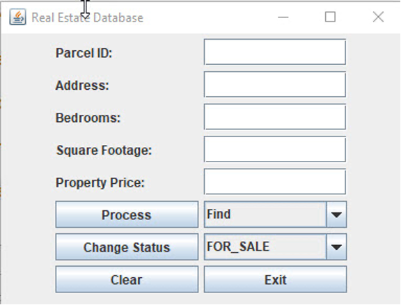

# Project 4 Instructions

The fourth programming project involves writing one program to manage 
a real estate database. This program should be comprised of an enumerated
type, an interface, and two parts. 

## Status Enum

The enumerated type should be named Status and should contain 
three enumeration literals, FOR_SALE, UNDER_CONTRACT and SOLD. 

## StatusChangeable Interface

The interface should be a generic interface named StatusChangeable and
it should have a bounded generic type parameter whose type must be an 
enumerated type. It should contain one abstract method changeStatus that 
has a parameter whose type is the generic type parameter.

## Property Class

The first part of the program is a class named Property. Among the 
processes are the implemented is the StatusChangeable interface. The 
elements for the property should contain variables:

1. The parcel id as integer
2. The property address stored as a string
3. The number of bedrooms stored as integer
4. The square footage stored as integer
5. The property price stored as integer
6. The status of the property whose type should be the enumerated type 
    Status with the equivalent integers of 0, 1, and 2.

### Property Methods

In addition, it should have the following three methods:

#### Constructor

- A constructor that accepts six parameters for the purpose of 
    initializing the characteristics of the property, specifically

    - Parcel id
    - Property address
    - Number of bedrooms
    - Square footage
    - Property price
    - Status

#### changeStatus Method

The status of the property should be set to FOR_SALE (0).

- A method named changeStatus that allows the status of the property 
    to be changed.
    
#### Overridden toString Method 
    
- An overridden toString method that returns a string containing the 
    parcel id, property address, number of bedrooms, square footage, 
    property price, and current status appropriately labeled.
    
## Program Core

### Program Core Methods

#### Main Method

The second part of the program is a Program Core and contains the 
main () method. 

### Static Variable for Property Class
- In addition, it should contain a class variable for 
    the Property class that defines the database of property records, 
    which is implemented as a HashMap, with the parcel id field (Integer) 
    as the key and a Property object as the value. 

- For consistency and feedback, there is a PRJ4Property.txt data file to 
    use with this project that contains all the data necessary to begin 
    the program. Directly read the data file (PRJ4Property.txt) into the 
    program and assign the values to the HashMap. `In the program the name 
    of the data file is entered with the relative path name, not the 
    absolute path. See Note at end of this document for clarification.` 
    For the documentation, a Transaction array is declared to hold the processing 
    implemented during the running of the program. Insert, delete, find, 
    and change status are the transaction during the processing of the 
    program. These are tags for each transaction followed by the 
    appropriate information about the transaction. So, the fields in the 
    Transaction array begin with the processing transaction, then the 
    parcel id and the remaining values in the HashMap.

### Displaying Output

The data file is read into the program and assigned into a HashMap. As 
each record is assigned, the program also displays the records of the 
data file using the toString() method in the IDE Output Window.

## Graphical User Interface

The program should generate the GUI shown below:

### Data Processing

The default process is Find. The default Change Status is FOR_SALE. 
Clicking the Process button should cause the selected choice of the 
three actions in the combo box to its right `Find, Insert, Delete` to 
be executed. When using the insert process to add a new property, the 
program should check for any non-integer values that may have been 
entered in any of the fields that require integers.  
`The following error messages should display in a JOptionPane window:`

### Error Handling

- After entering a number in the Parcel ID TextField if the number is 
    not in the database a message stating that fact is displayed. The 
    message should also display if the user clicks on the Process button 
    before any value is entered in the Parcel ID.
- When the Process button is clicked, the program checks that there is 
    an integer for the Parcel ID in the database. When the Insert 
    process is implemented, there is a check for integers in Bedrooms, 
    Square Footage, and Property Price TextFields. Each message 
    references to a specific TextField.
- If the user attempts to insert a Parcel ID, a key, that is already in 
    the database.
- If the user attempts to delete or find a record that is not in the 
    database. `Related to #1.`

### Success Handling

- After each successful operation is completed a JOptionPane window 
    displays confirming the success. 
- In the case of a successful Find request, a window should pop up 
    containing all the information in the associated Property object 
    using the toString() method.
- Clicking the Change Status button should cause status of the property 
    associated with the designated Parcel ID to be changed to status 
    selected in the combo box to its right. 
- The Change Status should be implemented any time there is a parcel 
    in the window. A JOptionPane window displays a confirmation of the 
    change.

<b>Include a Clear and an Exit button on the GUI Interface.</b>

## Recording User Activity

Each activity that the user performs is recorded in a Transaction array. 
The fields in the array include the transaction process, parcel id, 
property address, number of bedrooms, square footage, property price, 
and process/change of status activity.

## Upon Exit of Program

When the program ends, there are two displays of information displayed 
in the IDE Output Window: 

- The first set of data is the records in the Transaction array 
    displayed using the toString() method in the IDE Output Window 
    following the Transactions Completed tag. `For each process action 
    performed by the user, there is a transaction record.` 
- After the transactions, the second set of data display the newly 
    modified HashMap of the original set of data in the IDE Output Window 
    tagged as Modified Database displayed using the toString() method on 
    the Property objects. `See Output—edited below.`

## Programming Style

Be sure to follow good programming style, which means making all instance 
variables private, naming all constants, and avoiding the duplication of 
code. Furthermore, you must select enough different kinds of shapes to 
completely test the program.

### Absolute vs. Relative Path

<b>This is the absolute path:</b>

"C:\Users\Jones\Documents\CollegesUniversities\A UMUC\CMIS242\Assignments\Project 4\SPR 2020\PRJ4Property.txt"

<b>This is the relative path:</b>

"PRJ4Property.txt"

## Output

### Displaying Output Upon Reading TXT File 

`Display the data read into the program in the IDE Output Window. 
This is the display when the program begins executing.`

run: 
Parcel ID: 7623 
Property address: 563 Main St 
Number of bedrooms: 4 
Square footage: 2234 
Property Price: 243212 
Current status: UNDER_CONTRACT 

Parcel ID: 8729 
Property address: One State Blvd 
Number of bedrooms: 7 
Square footage: 4280 
Property Price: 1250000 
Current status: FOR_SALE 

Parcel ID: 7321 
Property address: 7865 W. Patrick Dr 
Number of bedrooms: 5 
Square footage: 3090 
Property Price: 26000 
Current status: SOLD 

Parcel ID: 3242 
Property address: 876 Northwest Way 
Number of bedrooms: 3 
Square footage: 1350 
Property Price: 175000 
Current status: FOR_SALE 

Parcel ID: 9823 
Property address: 76 Inverness Rd 
Number of bedrooms: 5 
Square footage: 2890 
Property Price: 398500 
Current status: SOLD 

Parcel ID: 2341 
Property address: 45871 Alpine Way 
Number of bedrooms: 5 
Square footage: 2850 
Property Price: 385750 
Current status: UNDER_CONTRACT 

Parcel ID: 8321 
Property address: 44 North Beach Cir 
Number of bedrooms: 3 
Square footage: 1750 
Property Price: 215250 
Current status: FOR_SALE 

Transactions Completed

`These are the various transactions processed while the program ran.`

### Checking for Property When It Does Not Exist

`To check that the PROPERTY DOES NOT YET EXIST, this check is processed.`

Find 
Parcel ID: 8521 
`Error message that ID not in database.`

### Adding Property to Database After   Confirming It Does Not Exist

`ADDING A PROPERTY TO THE DATABASE after checking that the Parcel ID 
does not yet exist in the database with the Find process, then using 
Insert process to add to the database.`

Find 
Parcel ID: 9999 
`Error message that ID not in database.`

Insert 
Parcel ID: 9999 
Property address: 14 Main Ave 
Number of bedrooms: 5 
Square footage: 3452 
Property Price: 354500 
Current status: FOR_SALE 

`To check to CONFIRM THAT THE PROPERTY WAS ADDED, there is a 
check to display data.`

Find 
Parcel ID: 9999 
Property address: 14 Main Ave 
Number of bedrooms: 5 
Square footage: 3452 
Property Price: 354500 
Current status: FOR_SALE 

### Changing the Status of a Parcel ID

`To change the STATUS OF A PARCEL ID, use the Find process to enter 
the values  of the Parcel ID that is being changed.`  

Find 
Parcel ID: 7623 
Property address: 563 Main St 
Number of bedrooms: 4 
Square footage: 2234 
Property Price: 243212 
Current status: UNDER_CONTRACT 

`To CHANGE THE STATUS OF THE PROPERTY, have the parcel values in the 
window. Change the combo box status from UNDER_CONTRACT to SOLD. 
Click the Change Status button. Click the Process button – it is 
assumed that Find is still in the combo box.`

Find 
Parcel ID: 7623 
Property address: 563 Main St 
Number of bedrooms: 4 
Square footage: 2234 
Property Price: 243212 
Current status: SOLD 

### Deleting a Property

`To check that the PROPERTY EXITS AND CAN BE DELETED, there is a check 
to display the data using the Find process. Then selecting the Delete 
process, click on the Process button.`

Find 
Parcel ID: 2341 
Property address: 45871 Alpine Way 
Number of bedrooms: 5 
Square footage: 2850 
Property Price: 385750 
Current status: UNDER_CONTRACT 

Delete 
Parcel ID: 2341 
Property address: 45871 Alpine Way 
Number of bedrooms: 5 
Square footage: 2850 
Property Price: 385750 
Current status: UNDER_CONTRACT 

`A message confirms the removal. To CHECK THAT THE PROPERTY WAS DELETED, 
there is a check to display the data.`

Find 
Parcel ID: 2341 
`Message displayed that the Parcel ID does not exist.`

Modified Database 
`The data in the file when the program ends.`

Parcel ID: 8321 
Property address: 44 North Beach Cir 
Number of bedrooms: 3 
Square footage: 1750 
Property Price: 215250 
Current status: FOR_SALE 

Parcel ID: 7623 
Property address: 563 Main St 
Number of bedrooms: 4 
Square footage: 2234 
Property Price: 243212 
Current status: SOLD 

Parcel ID: 8729 
Property address: One State Blvd 
Number of bedrooms: 7 
Square footage: 4280 
Property Price: 1250000 
Current status: FOR_SALE 

Parcel ID: 7321 
Property address: 7865 W. Patrick Dr 
Number of bedrooms: 5 
Square footage: 3090 
Property Price: 26000 
Current status: SOLD 

Parcel ID: 3242 
Property address: 876 Northwest Way 
Number of bedrooms: 3 
Square footage: 1350 
Property Price: 175000 
Current status: FOR_SALE 

Parcel ID: 9823 
Property address: 76 Inverness Rd 
Number of bedrooms: 5 
Square footage: 2890 
Property Price: 398500 
Current status: SOLD 

Parcel ID: 9999 
Property address: 14 Main Ave 
Number of bedrooms: 5 
Square footage: 3452 
Property Price: 354500 
Current status: FOR_SALE 

`Note Parcel No 2341 is not in above display – it was a deleted 
with a Delete process.`

BUILD SUCCESSFUL (total time: 2 minutes 12 seconds)
